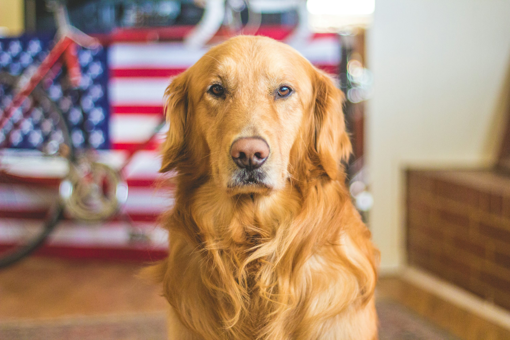

# Clasificador de Mascotas

¡Bienvenido a la aplicación de clasificación de mascotas! 🐾

Esta herramienta está desarrollada con Streamlit y permite cargar un modelo previamente entrenado para clasificar mascotas según diferentes características:

- **Peso**
- **Altura**
- **Color de ojos**
- **Largo del pelo**

## Ejemplo de Mascota

Puedes probar el clasificador y ver cómo funciona en el siguiente enlace:

[**Clasificador de Mascotas**](https://classipets.streamlit.app/)
